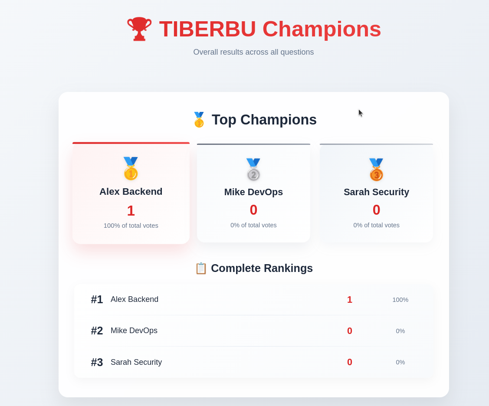
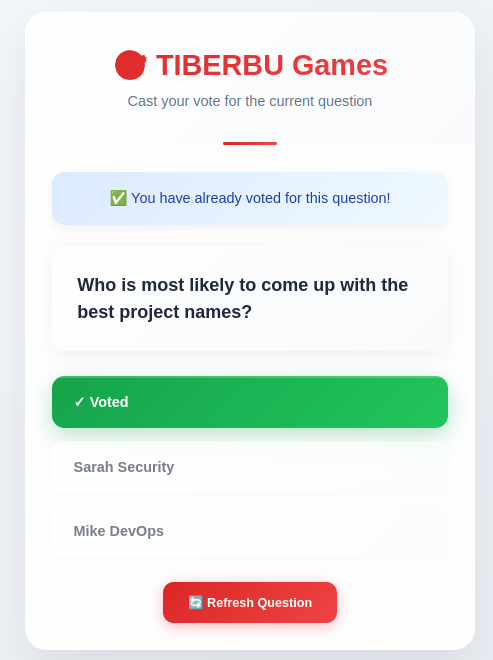
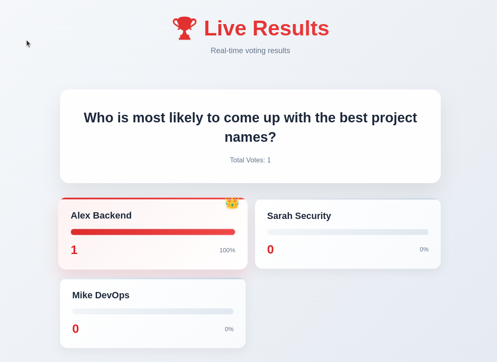
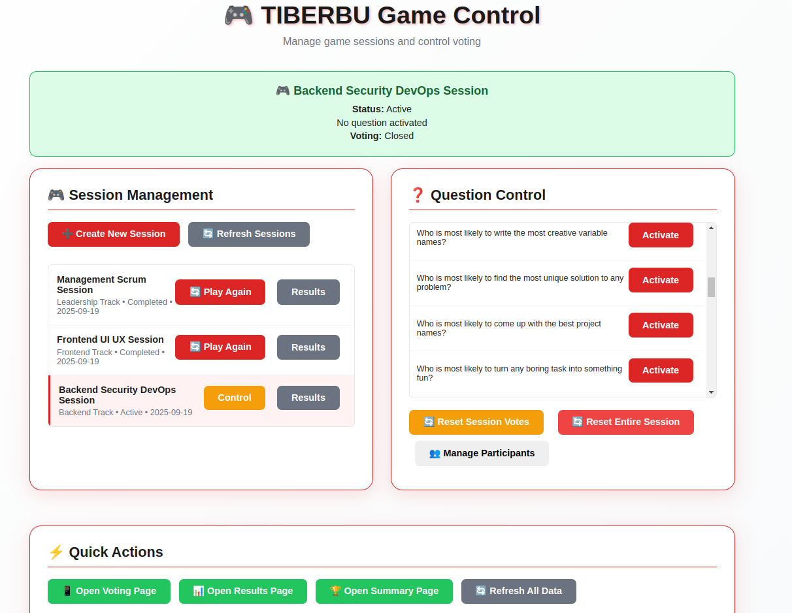

# 🎮 Tiberbu Games - Interactive Team Building App

> **"Who is most likely to..."** - A Kahoot-style team game that brings people together through fun, interactive voting!

Built with ❤️ using Frappe Framework for team building events, office parties, and social gatherings.

## 🌟 What is Tiberbu Games?

Tiberbu Games is an interactive team building application that creates engaging "Who is most likely to..." sessions. Perfect for breaking the ice, building team connections, and having fun with colleagues!

### 🎯 How It Works

1. **Admin creates sessions** with custom questions and participants
2. **Questions are displayed** one at a time with a countdown timer
3. **Everyone votes** for who they think fits the question best
4. **Results are revealed** in real-time with fun statistics
5. **Repeat** for as many questions as you want!

## ✨ Key Features

## 📸 Screenshots

### 🏆 TIBERBU Champions - Results Display


*Beautiful trophy podium showing top performers with vote counts and percentages. Perfect for revealing winners during your event!*

### 🗳️ TIBERBU Games - Voting Interface


*Clean, intuitive voting interface with clear question display, vote confirmation, and refresh functionality. Users can easily cast their votes and see confirmation.*

### 📊 Live Results Dashboard


*Real-time voting results with dynamic updates as votes come in during the session.*

### ⚙️ Admin Control Panel


*Comprehensive admin interface for managing sessions, questions, and participants.*


### 🎪 **Interactive Voting Experience**
- **One-click voting** - Simple, intuitive interface with clear options
- **✅ Vote confirmation** - Green checkmark and "You have already voted" notification
- **Duplicate prevention** - Smart blocking of multiple votes per user
- **🔄 Refresh question** - Easy button to get new questions
- **Mobile-friendly** - Clean responsive design works on all devices
- **No login required** - Just share the link!

### 🎮 **Admin Control Panel**
- **Session management** - Create, start, and control game sessions
- **Question activation** - Control which question is active
- **Live results** - See voting results as they happen
- **Participant management** - Add/remove team members easily

### 📊 **Smart Results & Analytics**
- **🏆 Championship podium** - Beautiful trophy display for top 3 winners
- **Real-time vote tallies** - Watch the votes roll in
- **Percentage breakdowns** - See who's winning with precise stats
- **Complete rankings** - Full leaderboard with all participants
- **Session history** - Review past games and champions
- **Play again feature** - Restart sessions with one click

### 🎨 **Pre-loaded Content**
- **89+ ready-to-use questions** across categories:
  - 🎭 **Fun** - Light-hearted and entertaining
  - 💼 **Professional** - Work-related scenarios
  - 🔧 **Technical** - For tech teams
  - 👑 **Leadership** - Management and leadership traits
  - 🤝 **Teamwork** - Collaboration scenarios
  - 🎨 **Creative** - Innovation and creativity
  - ⏰ **Work Habits** - Daily work behaviors

## 🚀 Perfect For

- **🏢 Office team building** - Break the ice with new colleagues
- **🎉 Company events** - Add fun to your next gathering
- **🍖 Koroga sessions** - Perfect for social events!
- **📱 Remote teams** - Connect virtually with interactive games
- **🎓 Training sessions** - Make learning more engaging
- **🎊 Social gatherings** - Any group that wants to have fun!

## 📱 Three Simple Interfaces

### 1. 🎛️ **Admin Dashboard** (`/admin`)
- Create and manage game sessions
- Control question flow and timing
- View live results and statistics
- Manage participants and questions

### 2. 🗳️ **Voting Interface** (`/vote`)
- Clean, simple voting experience
- Shows current question and participants
- One-click voting with instant feedback
- Works perfectly on mobile devices

### 3. 📊 **Results Display** (`/results`)
- Real-time vote visualization
- Perfect for projecting during events
- Shows percentages and vote counts
- Great for revealing winners!

## 🎯 Sample Questions

Get ready for questions like:
- *"Who is most likely to work through lunch without noticing?"*
- *"Who is most likely to have 47 browser tabs open at once?"*
- *"Who is most likely to solve problems while in the shower?"*
- *"Who is most likely to turn a 5-minute standup into a 30-minute discussion?"*
- *"Who is most likely to have the most creative solution to a problem?"*

## 🛠️ Technical Features

- **🌐 Web-based** - No app downloads required
- **📱 Responsive design** - Works on all devices
- **⚡ Real-time updates** - Live voting and results
- **🔒 IP-based voting** - Prevents duplicate votes
- **🎨 Clean UI** - Beautiful, intuitive interface
- **🚀 Fast deployment** - Ready to use in minutes

## 🎮 Game Flow

```
1. Admin creates session with questions & participants
2. Admin starts the session and activates first question
3. Players visit /vote and see the active question
4. Everyone votes for their choice
5. Results display on /results in real-time
6. Admin activates next question
7. Repeat until all questions are done!
8. Review session results and play again if desired
```

## 🎊 Why Teams Love It

- **🤣 Builds connections** through shared laughter
- **🎯 Breaks down barriers** between team members
- **⚡ High energy** and engaging format
- **📱 Easy participation** - just click and vote
- **🎨 Customizable** - add your own questions
- **🔄 Replayable** - different results every time

## 🚀 Quick Start

1. **Deploy** the app to your Frappe site
2. **Import questions** via Excel (89 questions included!)
3. **Create sessions** with your team members
4. **Share the voting link** with participants
5. **Start playing** and watch the fun unfold!

## 🎯 Perfect for Your Next Event!

Whether it's a koroga, team building session, or just a fun Friday afternoon activity, Tiberbu Games brings people together through interactive entertainment.

**Ready to bring your team closer together? Let's play!** 🎮

---

*Built with curiosity and a bit of "why not?" energy using Frappe Framework* 😄
